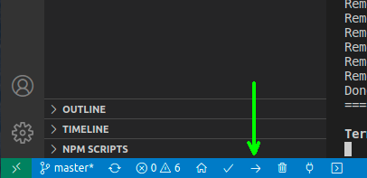

# ESP32-http-websocket

[](https://github.com/DominikN/ESP32-http-websocket/stargazers/)

[](https://github.com/DominikN/ESP32-http-websocket/actions/workflows/build.yml)
[](https://github.com/dominikn/ESP32-http-websocket/blob/master/LICENSE)


**_ESP32 + HTTP server + websockets + Bootstrap + Husarnet. A simple project template showing how to use those technologies to create a fast, pretty and secure web UI hosted on ESP32. Works in LAN and over the internet. Written using Arduino framework._**

## Intro

This template can be a base for your own ESP32 based projects needing a responsive web user interface. It is written using Arduino framework, AsyncWebServer and ArduinoJson. I show here how to develop both C++ and HTML part of the project in a clear way.

The template combines all useful technologies in one:

- **WebSockets** - to provide a fast and elegant communication between web browser and ESP32 withough reloading a page like in case of HTTP requests. We use [ESPAsyncWebServer](https://github.com/me-no-dev/ESPAsyncWebServer) library to make a connection even faster.
- **Bootstrap 4** - one of the most popular frameworks for rapid web page design. Thanks to Bootstrap you can easily write a pretty web UI, looking good both on mobile and desktop devices.
- **JSON** - an elegant way to format data exchanged between web browser and ESP32.
- **Husarnet** - a Virtual LAN network thanks to which you can access ESP32 both from LAN network and through the internet, without static IP adressess, setting port forwarding on your router etc. Basically you can make easily upgrade your existing project working in LAN to work over the Internet by just 4 extra lines of code (if your project is based on AsyncTCP - if it uses WiFiClient & WiFiServer classes you need also to replace them by, respectively, HusarnetClient & HusarnetServer classes).
```cpp
  #include <Husarnet.h>

  ...

  /* Start Husarnet */
  Husarnet.selfHostedSetup(dashboardURL);
  Husarnet.join(husarnetJoinCode, hostName);
  Husarnet.start();

  ...
```
- **Platformio** - An extension for Visual Studio Code that handles all configuration for embedded project for you. Thanks to Platformio you can just clone the project repository, provide your network credentials and just click "Upload" button to program your board. Platformio handles all configuration and cloning appriopriate libraries from repos in the background.

## Full instruction

A demo is really basic:

- control a LED connected to ESP32 by using a button in web UI.
- update cnt value in the web ui every 1s
- ESP32 sends a button state to change a color of the dot in web UI.

To run the project, open Visual Studio Code with Platformio extension and follow these steps:

### 1. Clone the project repo:

```bash
git clone https://github.com/DominikN/ESP32-http-websocket.git
```

### 2. Open ESP32-http-websocket project folder on your local machine from VSC with platformio extension installed

File > Open Folder > ESP32-http-websocket

### 3. Add your network credentials

- Open **ESP32-http-websocket.ino** file
- Enter your Wi-Fi network credentials here:
```cpp
// WiFi credentials
#define NUM_NETWORKS 2
// Add your networks credentials here
const char* ssidTab[NUM_NETWORKS] = {
    "wifi-ssid-one",
    "wifi-ssid-two",
};
const char* passwordTab[NUM_NETWORKS] = {
    "wifi-pass-one",
    "wifi-pass-two",
};
```
- Enter your **Husarnet Join Code** here:
```cpp
const char* husarnetJoinCode = "xxxxxxxxxxxxxxxxxxxxxx";
```
To find your Husarnet Join Code setup a free account at https://app.husarnet.com > click **[Create network]** button > go to **join code** tab . It will look like this: `fc94:b01d:1803:8dd8:b293:5c7d:7639:932a/XXXXXXXXXXXXXXXXXXXXX`

### 4. Upload code to your board

Just click this button in VSC + Platformio


### 5. Open WebUI

Add your laptop to the same Husarnet network as ESP32 board. In that scenerio no proxy servers are used and you connect to ESP32 with a very low latency directly with no port forwarding on your router! Currenly only Linux client is available, so open your Linux terminal and type:

- `$ curl https://install.husarnet.com/install.sh | sudo bash` to install Husarnet.
- `$ sudo systemctl restart husarnet` to start husarnet daemon after installation
- `$ husarnet join XXXXXXXXXXXXXXXXXXXXXXX mylaptop` replace XXX...X with your own `join code` (the same as in 3), and click enter.

At this stage your ESP32 and your laptop are in the same VLAN network. The best hostname support is in Mozilla Firefox web browser (other browsers also work, but you have to use IPv6 address of your device that you will find at https://app.husarnet.com) and type:
`http://esp32websocket:8000`
You should see a web UI to controll your ESP32 now.


