# Matchboxscope

This device is not much larger than a matchbox (hence its name - surprise..). Besides the ESP32-CAM it only needs 3D printed components, screws, aluminium foil and (optional) springs.
Below, we will guide you through the process to build the full device that will be powered with a USB powerbank or power supply

<a href="#logo" name="logo">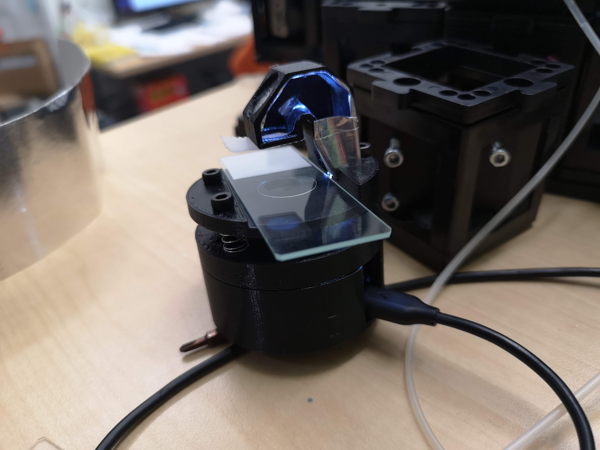</a>

## Some theory

*Why can you actually magnify?* Good question! In fact, we don't magnify at all, but since the pixels of the OV2460 camera are really small and we make use of the objective lens with a relatively small focal length (f'=~5mm), we perform a "4f-imaging". In this context this means, we have a sample at a distance of 2f (focal lengths) in front of the lens, which will in turn create an image at 2f away from it. The camera chip will digitize the image and send it over to your displaying device. You can tune the magnification by changing the distance between sample-lens and lens-sensor. The formular is give by:

`M=a'/a`, where `M`is the magnification, `a'` the distance sample-lens, `a` the distance lens sensor. Further:

`1/f'=1/a' - 1/a`;

You can easily display the ~100µm sized pixels of your phone's screen. By tuning the distanve you can play with the field of view, resolution (since the imaging NA changes) and magnification. We don't care about sampling right now, since we do not have much of an influence on it anyway..

<a href="#logo" name="logo">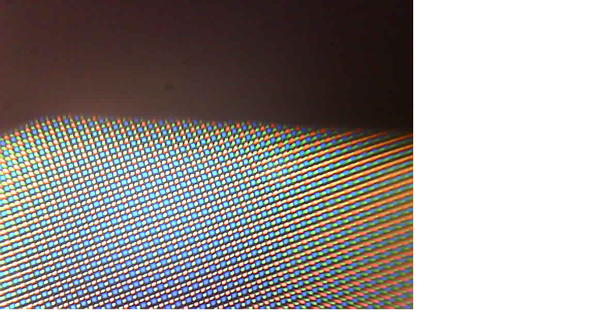</a>

<a href="#logo" name="logo">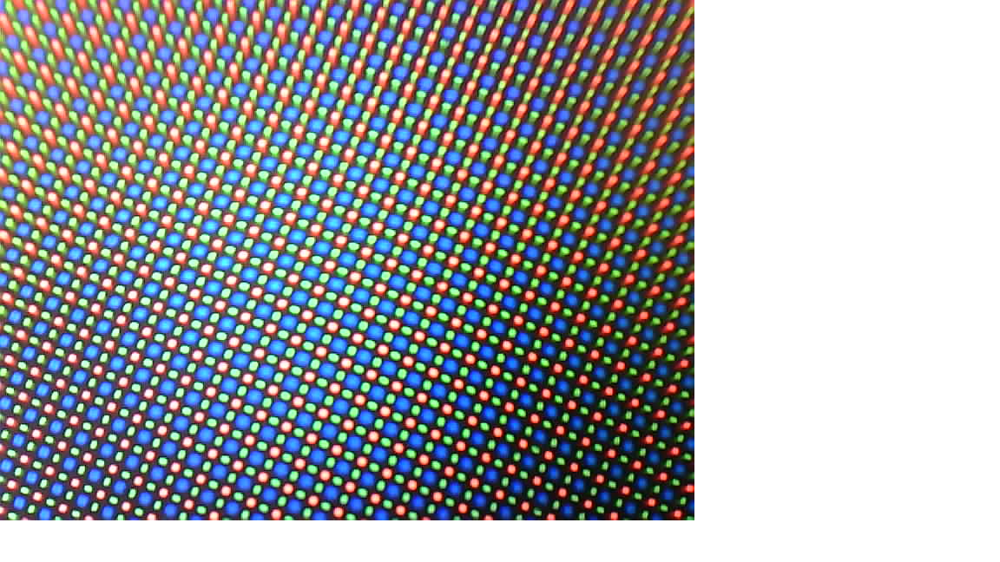</a>

Essentially, this configuration is also known as a finite-corrected microscopy arrangement. It comes with a series of problems, but we want to keep it simple, hence we will stick to the basic optical setup here.

*Why don't we need any illumination?* Yet another good question. Where there is no light, we won'T see anything. Obviously. But: The ESP32 has an insanely strong LED Torch/light that can be switched on/off and even be dimmed. Luckily, we can make us of it for illuminating our sample for transmission microscopy. Wait, how can that be done? Easy! We construct a little periscoe/mirror-tunnel that simply reflect the light back to the sample. The efficiency must be well below 10%, perhaps even 1%, but since the Torch is so bright, it still works!

This how it looks like - like an [Anglerfish](Anglerfish.md):

<a href="#logo" name="logo">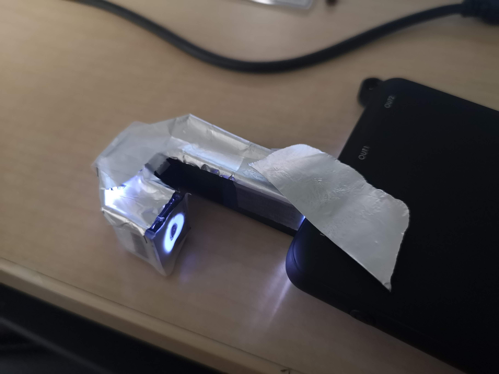</a>

<a href="#logo" name="logo">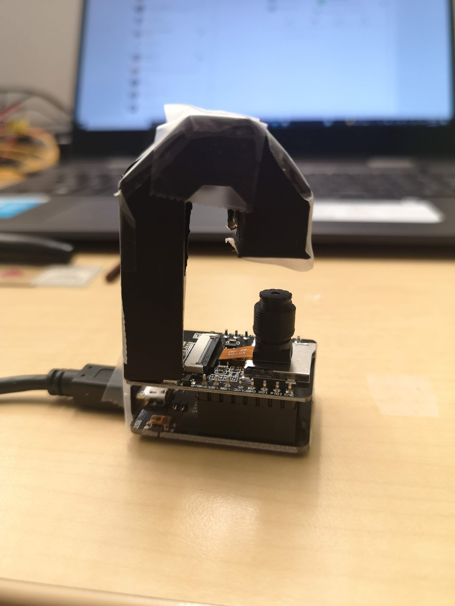</a>

# Assembly

We will give you a step-by-step guide how to assemble the hole microscope. If anything fails or doesnt' match as expected (most likely), please file an issue immediately. We will be there for you.

## Components

This you will need for your device in order to work:

### Bill of material

Part |  Purpose | Source | Price |
:----------------:|:------------:|:----------------:|:------------:
ESP32-CAM (MB) | |  | 6€
USB Micro Cable ||| 1€
M3 Screws (Cylindrical head, 15mm, 8mm)|||
3D printing material (PLA) |||
Aluminium foil (sticking if possible)|||
Sticky tape |||
Springs |||

## Assembly of the illumination unit

The idea of the illumination unit is to re-use the LED torch that is mounted on the ESP32-CAM and can be controlled through GPIO4. Don't look directly into the LED. As said, it'S bright!

Print the little periscope and add aluminium foil inside the little channel, but keep the round holes open. Double-sided sticky tape will help you to mount the aluminium foil. Alternatively, use self-sticky aluminium foil. Tweezers help you in the process of placing the foil.

<a href="#logo" name="logo">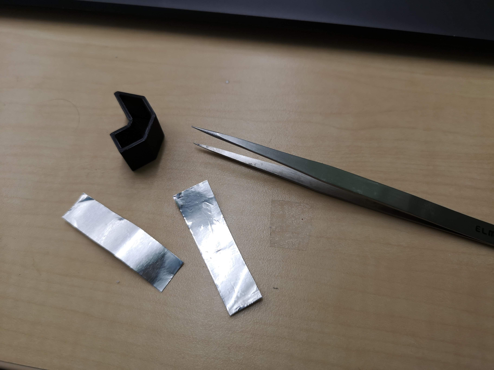</a>

<a href="#logo" name="logo">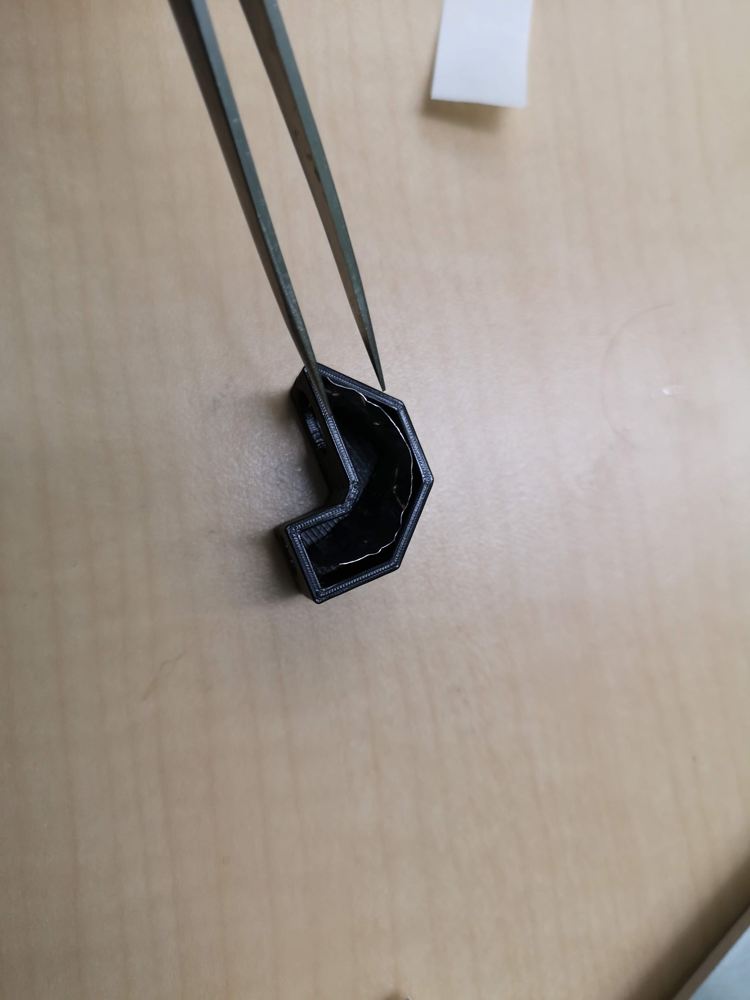</a>

You can also seal the "light-channel" with additional aluminium foil. A small piece of diffuse Sticky-tape/scotch tape (3M) on the end of the channel will make the illumination much smoother but is not necessary (actually not visible on the photo).

## Assembly of the Microscope

These are the parts you will need to assemble the microscope. Tools are: your hands, an M3 compatible hex key, the tweezers you used before and patience.

<a href="#logo" name="logo">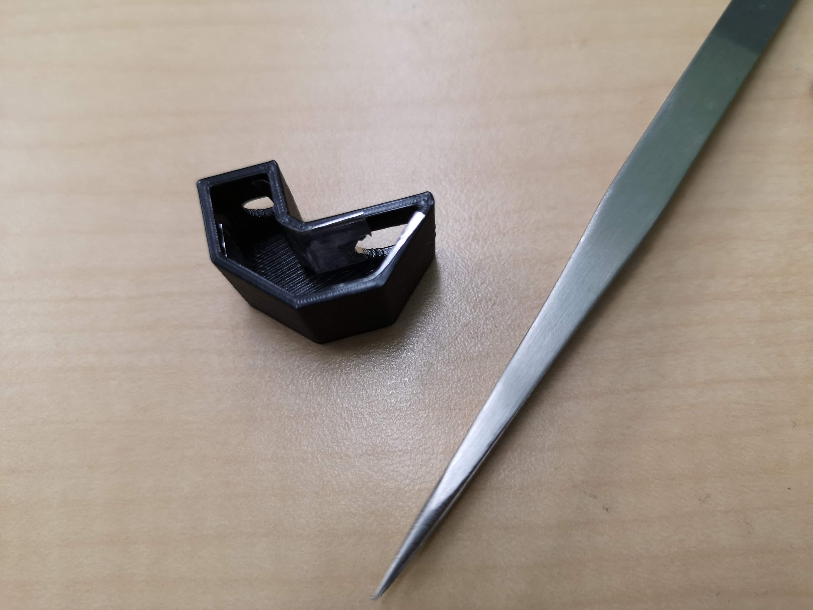</a>

<a href="#logo" name="logo">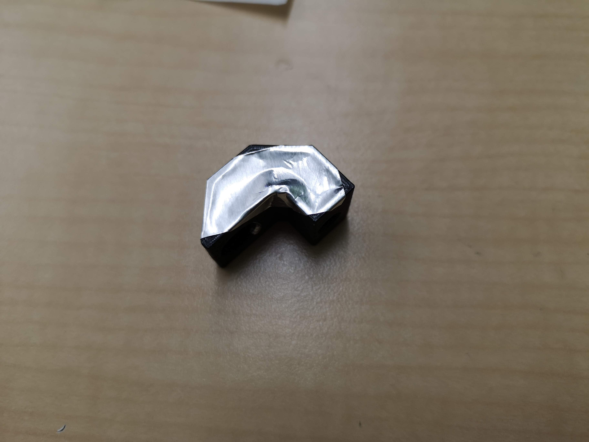</a>

## Prepare the camera
First of all, remove the lens inside the camera. Be careful to not rip apart the flexible PCB. This is most likely the most crucial part where things my fail. The lens is threaded into the sensor assembly and then glued to not loos focus. You have to release this glue by unscrewing it with some force. Use the tweezers or pliers. BUT: Be careful to not destroy the lens or the camera.

## Assemble the stage

Now that the camera lens is gone, add the flatband cable/flex PCB to the ESP board and stick the round plastic case of the sensor through the 3D printed base as indicated below. The orientation of the circular part is right if the label "SD" aligns with the side of the microSD card slot.

Now add the second base to the assembly and fix the sandwich with 4 M3x15 screws

The result may look like in the image below. Now: Add the objective lens from the camera, which you unscrewed earlier to the tube (this may be deprecated since the middle layer already contains the tube).

In the next step, insert the tube into the thread from the camera sensor unit:

Equip all 3 screws that will mount the top layer to the middle layer (M3x20, cylindrical head) with springs that will push the layer away from the camera.

Mount the top layer to the camera such that all springs are *"under pressure"*

..and from the other side:

<a href="#logo" name="logo">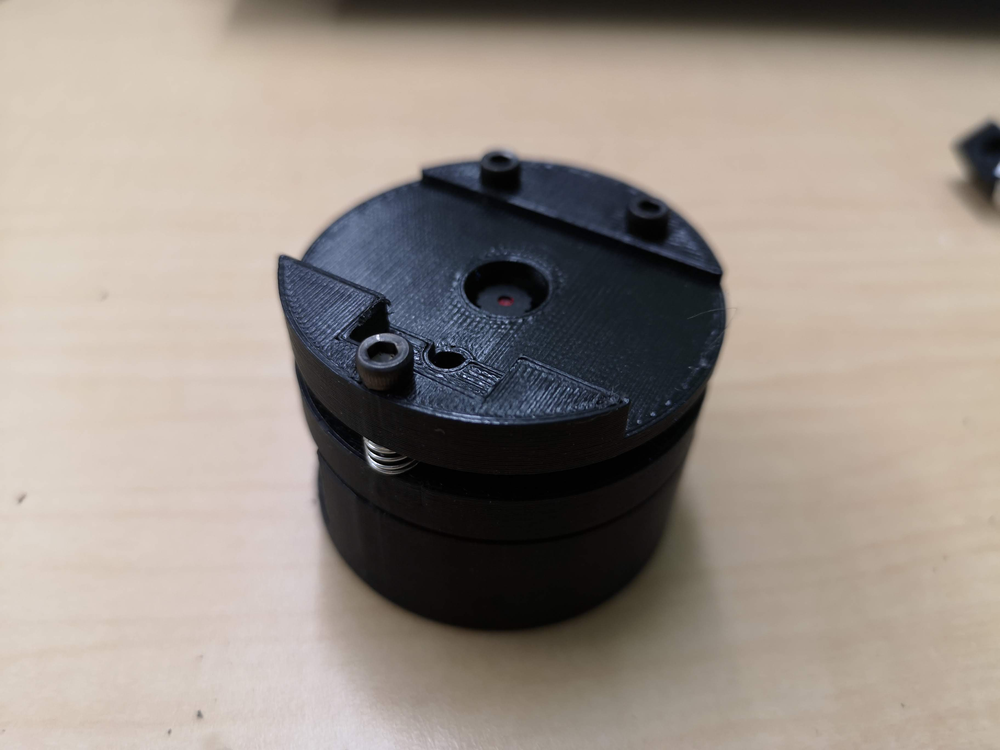</a>

Add the illumination unit, insert the microSD card and you're almost done.

<a href="#logo" name="logo">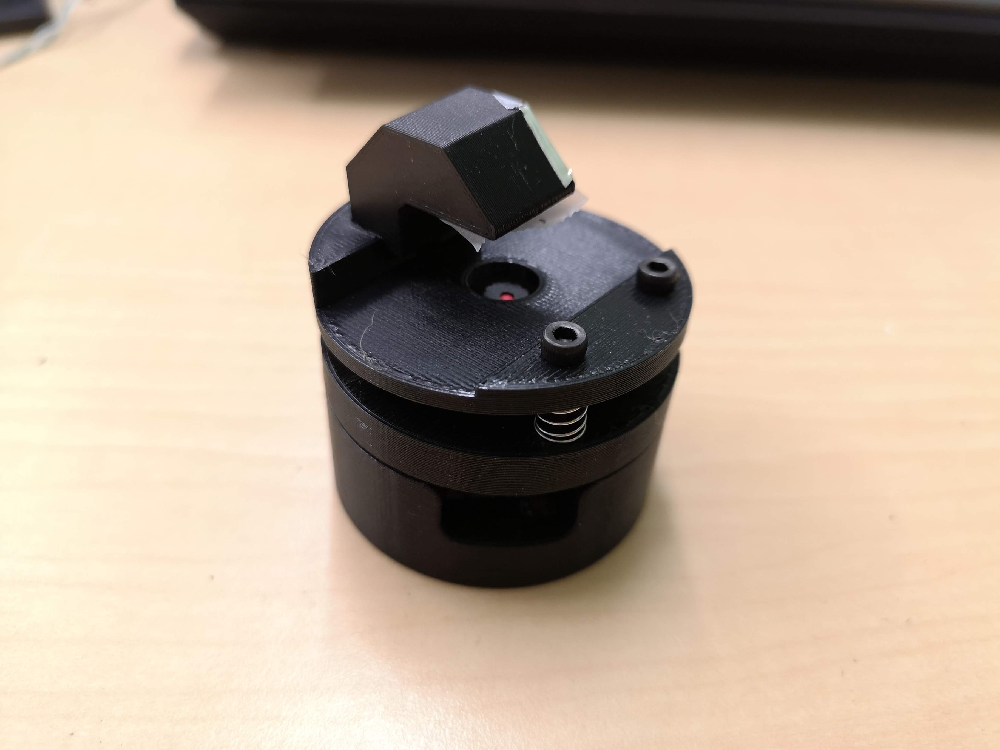</a>

For remote operation: Add the powerbar and look for a Wifi signal/SSID that may be called "Blynk". Connect to it and open the page http://192.168.4.1
