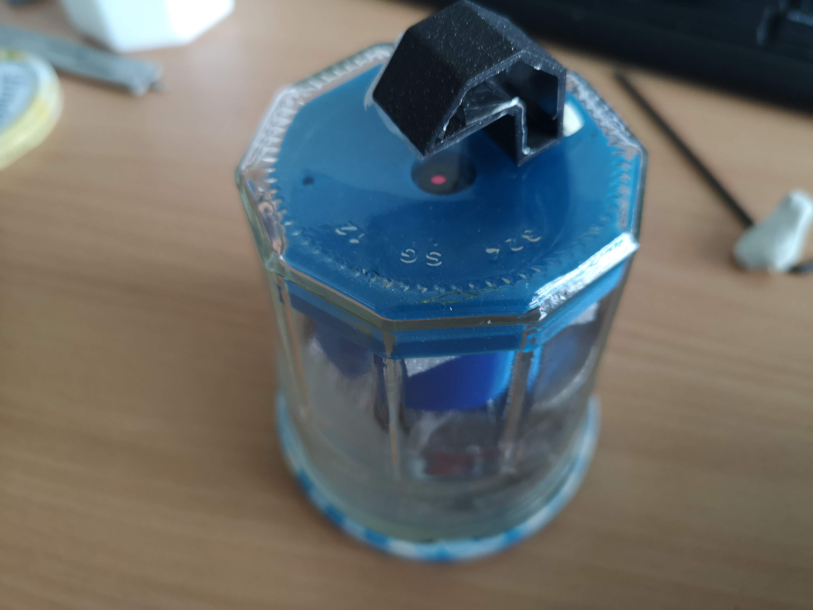

# Matchboxscope

This device is not much larger than a matchbox (hence its name - surprise..). Besides the ESP32-CAM it only needs 3D printed components, screws, aluminium foil and (optional) springs.
Below, we will guide you through the process to build the full device

<!---  --->

The Matchboxscope just need some juice on usb and can work using a powerbank. It has wifi capabilities and it can stream the images to whataver device you want :) 

## Some theory

*Why can you actually magnify?* Good question! In fact, we don't magnify at all, but since the pixels of the OV2460 camera are really small and we make use of the objective lens with a relatively small focal length (f'=~5mm), we perform a "4f-imaging". In this context this means, we have a sample at a distance of 2f (focal lengths) in front of the lens, which will in turn create an image at 2f away from it. The camera chip will digitize the image and send it over to your displaying device. You can tune the magnification by changing the distance between sample-lens and lens-sensor. The formular is give by:

`M=a'/a`, where `M`is the magnification, `a'` the distance sample-lens, `a` the distance lens sensor. Further:

`1/f'=1/a' - 1/a`;

You can easily display the ~100µm sized pixels of your phone's screen. By tuning the distanve you can play with the field of view, resolution (since the imaging NA changes) and magnification. We don't care about sampling right now, since we do not have much of an influence on it anyway..

Essentially, this configuration is also known as a finite-corrected microscopy arrangement. It comes with a series of problems, but we want to keep it simple, hence we will stick to the basic optical setup here.

*Why don't we need any illumination?* Yet another good question. Where there is no light, we won'T see anything. Obviously. But: The ESP32 has an insanely strong LED Torch/light that can be switched on/off and even be dimmed. Luckily, we can make us of it for illuminating our sample for transmission microscopy. Wait, how can that be done? Easy! We construct a little periscoe/mirror-tunnel that simply reflect the light back to the sample. The efficiency must be well below 10%, perhaps even 1%, but since the Torch is so bright, it still works!

This how it looks like - like an [Anglerfish](Anglerfish.md):

## Z Stage 

In the Matchboxscope, the Z stage is controlled by magnets and by three screws. The magnets between the middle part and the top part are repelling each other and in this way keeping the sample stage in place: 

 

If you are, somehow adverse to magnets, you can use springs as well. In this case we suggest to use a nut for safaty (and not to shoot the spring loaded  glass slide in the sky). 

 

## Components

This you will need for your device in order to work:

### Bill of material

Part |  Purpose | Source | Price |
:----------------:|:------------:|:----------------:|:------------:
ESP32-CAM (MB) | |  | 6€
USB Micro Cable ||| 1€
M3 Screws (Cylindrical head, 20mm, 12mm)|||
3D printing material (PLA) |||
Aluminium foil or silver spray paint (sticking if possible)|||
Neodymium magnets round 12x2 or 12x3|||
Springs (for the spring version) |||

## 3D printing files

All design files can be found in the folder [INVENTOR](./INVENTOR).

All 3D-printable files can be found [here](./STL/IncubatorMicroscope_static):

The Matchboxscope is composed of three parts:

The bottom part, for the ESP32 board

The middle part, which acts as a spacer between the lens and the camera sensor

The top part (the sample part), for holding the glass slide and the illumination periscope.

So far there are three different possibilities for the top part: a flexure to fix the glass slide, a squared 18x18mm for coverslips, and a flat large one to be used with a magnet. The choice is yours:  

A previous version looked like this:

## Assembly of the microscope

a video of the build can be found here: https://www.youtube.com/watch?v=iw_hoDRlnpg  

Once you have obtained the parts, the assebly can be done in 5 minutes. 

You need: the ESP32 cam, the 3D printed parts, 3 M3x20 or M3x25 screws, 3 M3x16 screws, 12x2 or 12x3 neodymium magnets, superglue, M3 Allen Key, plier and tweezers. 

With a plier, and very gently, unscrew the lens from the ESP32 camera and, if not attached yet, attach it to the board. 

put the lens on the 3D printed "middle" part, and the board in the 3D printed "bottom" opart. Alling the middle part and the bottom part. 

once alligned, push the middle part to fix the camera on the 3D printed part. Once the camera is in the 3D printed middle part, bend the camera cable to allign the two 3D printed parts. 

screw the two parts using 3 M3x16 screw, and glue the magnets in position (both with polarity pointing in the same direction) 

glue the other two magnets on the 3D printed sample part, and remmeber that the the magnet should repel the ones on the middle part. 

 
Screw the M3x20 in position and attach the illumination periscope. If needed, add more magnets to make the repuslion sturdier.

and here you go. Enjoy your new tiny scope. 

## Assembly of the illumination unit

Some additional information for the assembly process can be found in the [Anglerfish](Angleffish.md)-documentation.

The idea of the illumination unit is to re-use the LED torch that is mounted on the ESP32-CAM and can be controlled through GPIO4. Don't look directly into the LED. As said, it's bright!

One option is to glue, or stick some aluminium foil in the "periscope". Another option is to use sliver spray paint to paint it (or use any silver paint you want). Both option worked fine: 

Print the little periscope and add aluminium foil inside the little channel, but keep the round holes open. Double-sided sticky tape will help you to mount the aluminium foil. Alternatively, use self-sticky aluminium foil. Tweezers help you in the process of placing the foil.

You can also seal the "light-channel" with additional aluminium foil. A small piece of diffuse Sticky-tape/scotch tape (3M) on the end of the channel will make the illumination much smoother but is not necessary (actually not visible on the photo).

## Pictures taken with the Matchboxscope 

